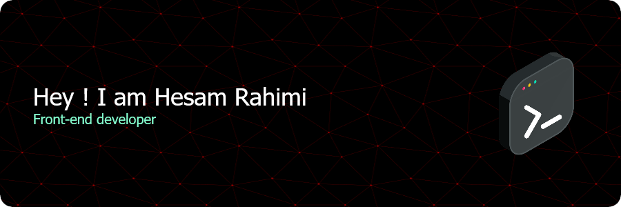

I am a front-end developer who has been working in this field since 2022. I am eager to learn and improve my skills in designing and developing user-friendly websites, and I am interested in collaborating on team projects to deliver effective front-end solutions.

<h3 align="left">My Technical Skills:</h3>
  
  

<h3 align="left">Connect with me:</h3>

  

  

<!--START_SECTION:waka-->
<!--END_SECTION:waka-->
